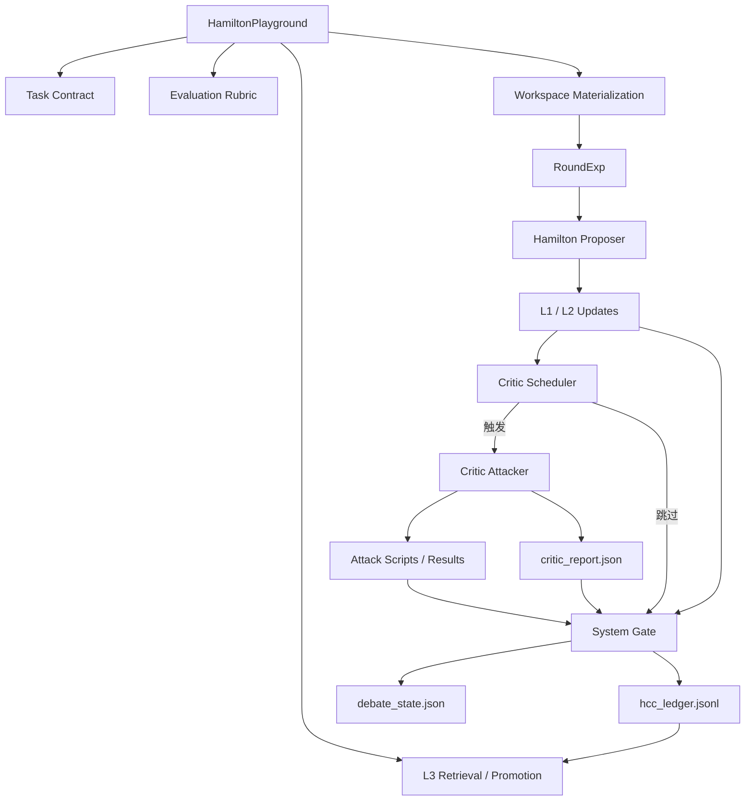
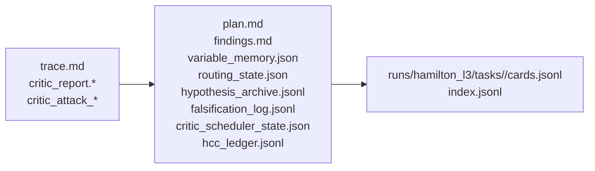

# Hamilton

<div align="center">

**基于 EvoMaster 的冗余变量感知符号回归 Agent**

*HCC 分层上下文管理 + GAN 启发的对抗式 proposer/critic 编排，用于科学方程发现与证伪。*

[简介](#introduction) • [核心特性](#key-features) • [系统架构](#architecture) • [工作流](#workflow) • [快速开始](#quick-start) • [输出说明](#outputs) • [当前状态](#current-status)

</div>

---

## <a id="introduction"></a>📖 简介

**Hamilton** 是 EvoMaster 中面向符号回归（Symbolic Regression）的 playground，当前重点用于解决：

- **冗余变量条件下的支持集识别**
- **跨工况结构一致性的方程发现**
- **以证伪为中心的科学迭代**
- **跨任务经验迁移**

它不再把问题简单理解为“找到 MSE 最低的公式”，而是把任务改写为一个联合问题：

1. 找到**最小且稳定的支持集**
2. 在支持集上恢复**可解释的方程结构**
3. 主动设计反例或干预实验，验证哪些规律只是伪规律

当前分支的两条主创新线索是：

1. **HCC 启发的分层上下文管理系统**
2. **GAN 启发的对抗式双 Agent 架构**

也就是说，Hamilton 已经不是一个“单 Agent 不断拟合”的简单回路，而是一个由：

- **Hamilton proposer**
- **Critic attacker**
- **HCC / L3 记忆**
- **任务契约与评价 rubric**

共同组成的多轮科学研究系统。

这种设计特别适合 VIV 方程族发现这类任务，因为这类任务真正关心的不是瞬时误差最小，而是：

- 跨风速/跨工况的**结构一致性**
- 长时间积分后的**动力学正确性**
- 结果的**物理可解释性**
- 在对抗性攻击下是否仍然站得住

---

## <a id="key-features"></a>✨ 核心特性

### 1. 🧠 HCC 分层上下文管理

Hamilton 使用三层 HCC 风格记忆：

- **L1**：轮级执行记录
- **L2**：任务级工作记忆
- **L3**：跨任务可迁移经验

它不会把原始长对话直接塞进长期记忆，而是只保留 distilled scientific experience，例如：

- 支持集先验
- 工具路由经验
- 失败模式
- 评价 rubric
- 正/负面经验与来源证据

### 2. ⚔️ GAN 启发的对抗式双 Agent

Hamilton 采用 **proposer / critic** 结构，但 Critic 不是“第二个写总结的 Agent”，而是**攻击者**：

- 专门挑结论中的薄弱环节
- 主动设计干预实验
- 通过消融、极端值测试、OOD slice 等方式拆穿伪规律
- 阻止未经验证的正向结论进入长期记忆

从运行机制上看，它更接近：

`生成候选 -> 主动攻击 -> 存活者才允许上升`

而不是简单的双 Agent 轮流说话。

### 3. 📚 共享但带极性的 HCC

Hamilton 与 Critic 共用一套 HCC，但每条经验都显式记录：

- `polarity: positive | negative`
- `producer_role: hamilton | critic | system`
- `consumer_scope: hamilton | critic | both`
- `survived_attack`
- `evidence_strength`

这样系统既能记住：

- 什么做法通常更容易收敛、更可能正确

也能记住：

- 什么结论曾经看起来合理，但后来被真实攻击拆穿

### 4. 📏 任务化评价 Rubric

Hamilton 不默认只看 `MSE`。

运行时会把任务约束、内置指标库和可选 paper 提示物化成结构化的 `evaluation_context`，因此它可以按任务类型切换评价重点，例如：

- 拟合精度
- 支持集稳定性
- 结构一致性
- 长时间 rollout 稳定性
- amplitude / phase / frequency fidelity
- 物理一致性

### 5. 🧪 基于真实工件的结论门控

Hamilton 有一套 completion gate，会阻断“口头上说做了实验，但没有真实产物”的 finish。

它会检查本轮是否真的留下了：

- `trace.md`
- `plan.md`
- `findings.md`
- 至少一个 machine-readable state
- 在需要时，还要有真实 `scripts/*` 或 `results/*`

这使得系统逐步从“会写研究叙述”推进到“会留下可审计的科学证据链”。

---

## <a id="architecture"></a>🏗️ 系统架构

## 整体总览



## 记忆分层示意



## 关键组件

| 组件 | 作用 |
|------|------|
| `HamiltonPlayground` | 任务级 orchestration、workspace 初始化、task contract 解析、evaluation materialization、L3 retrieval/promotion |
| `RoundExp` | 单轮状态机：Hamilton proposer、Critic 调度、可选攻击轮、completion gate、HCC 更新 |
| `Hamilton proposer` | 生成候选结构、更新计划/发现/状态、执行拟合与验证脚本 |
| `Critic attacker` | 质疑结论、运行轻量攻击实验、产出结构化阻断证据 |
| `hcc_ledger.jsonl` | 任务内结构化事实账本，记录 polarity、证据与来源 |
| `L3 store` | 跨任务负/正经验卡片存储 |

---

## <a id="workflow"></a>🔄 工作流

## 轮级协议

```text
Round N
  ├─ 系统初始化 history/roundN/*
  ├─ 系统加载：
  │    task_contract.json
  │    evaluation_context.json
  │    L2 state
  │    L3 retrieval context
  │
  ├─ Hamilton proposer
  │    ├─ 读取任务、rubric、HCC、历史 blocker
  │    ├─ 决定本轮工具路径
  │    ├─ 执行拟合 / 分析 / 验证 / 证伪
  │    └─ 更新 L2 与本轮工件
  │
  ├─ Critic scheduler
  │    ├─ 周期触发：3, 6, 9, ...
  │    └─ 事件触发：
  │         finish claim / 强结论 / 新结果 /
  │         blocker response / required evidence claim
  │
  ├─ Critic attacker（若被触发）
  │    ├─ 审查 Hamilton 本轮产物
  │    ├─ 设计 0-2 个轻量攻击实验
  │    ├─ 执行攻击脚本
  │    └─ 写出 critic_report + attack artifacts
  │
  ├─ System gate
  │    ├─ 验证真实工件更新
  │    ├─ 若本轮触发 Critic，则检查 Critic 是否批准
  │    └─ 更新 debate_state / scheduler_state / hcc_ledger
  │
  └─ 若任务真正完成则停止，否则进入下一轮
```

## Critic 为什么重要

Critic 的作用不是“最后给个分”。

它的真实职责是：

- 拆穿薄弱支持集
- 针对方程结构做消融
- 在高风险结论出现时主动干预
- 用真实反例阻止伪规律进入长期记忆

当前 challenge taxonomy：

- `support_set_attack`
- `structure_attack`
- `ood_generalization_attack`
- `physics_consistency_attack`
- `numerical_stability_attack`
- `evidence_gap_attack`

当前 intervention types：

- `extreme_value_probe`
- `support_ablation`
- `ood_slice_probe`
- `perturbation_probe`
- `physics_counterexample`

---

## HCC 与 L3

## HCC 设计原则

Hamilton 的 HCC 不是聊天记录，而是**面向事实的研究记忆**。

每条长期经验都尽量回答：

- 谁提出了什么结论？
- 它有没有真实证据？
- 它有没有被攻击过？
- 它是否挺过了攻击？
- 这条经验将来该给谁看？

### L1：轮级记忆

存放在 `history/round{N}/` 下。

典型文件：

- `trace.md`
- `critic_report.md`
- `critic_report.json`
- `critic_attack_plan.json`
- `critic_attack_log.jsonl`
- `scripts/*`
- `results/*`
- `critic_attacks/scripts/*`
- `critic_attacks/results/*`

### L2：任务级记忆

存放在当前 workspace 根目录。

典型文件：

- `plan.md`
- `findings.md`
- `variable_memory.json`
- `routing_state.json`
- `hypothesis_archive.jsonl`
- `falsification_log.jsonl`
- `critic_scheduler_state.json`
- `debate_state.json`
- `hcc_ledger.jsonl`

### L3：跨任务记忆

存放在 `runs/hamilton_l3/`。

主要用于：

- 迁移失败模式
- 迁移评价与验证经验
- 迁移支持集先验
- 给未来任务注入保守的负面提醒

## Promotion 规则

- **positive 经验**
  - 必须有真实证据
  - 如果被 Critic 攻击过，还需要 `survived_attack=true`
- **negative 经验**
  - 只要有真实攻击结果或反例，就可以 promotion

在当前分支里，L3 是刻意保守的，因此更倾向于保留 **negative failure cards**，而不是过早保存正向“发现”。

---

## 任务契约与评价 Rubric

Hamilton 支持在 `task.md` 顶部写可选 front matter。运行时会归一化成 `task_contract.json`，再进一步物化成：

- `evaluation_context.json`
- `evaluation_context.md`

示例：

```yaml
---
protocol:
  evidence_policy: advisory
  review_focus: [support_set, physics_consistency]
  evaluation_profile: dynamics_identification
  evaluation_metrics: [R2, limit_cycle_fidelity, amplitude_error]
  paper_rubric_sources: [paper/README_CN.md]
  required_evidence:
    fit: [script, result, trace_metrics]
    falsification: [result, trace_falsification]
---
```

内置 evaluation profile：

- `sr_regression_basic`
- `sr_structure_discovery`
- `dynamics_identification`
- `physics_law_discovery`

内置指标库：

- **拟合类**：`MSE`、`MAE`、`R2`、`nRMSE`
- **结构类**：支持集稳定性、结构一致性、复杂度/稀疏性
- **泛化类**：OOD slice consistency、跨工况迁移
- **动力学类**：amplitude / phase / frequency error、rollout stability、limit-cycle fidelity
- **物理类**：monotonicity、symmetry、conservation/residual consistency

这也是为什么 Hamilton 能够适应“不同任务评判标准不同”的情形，而不需要默认退回到单一 MSE。

---

## 运行时 Workspace

```text
{run_dir}/workspaces/task_0/
├── task.md
├── task_contract.json
├── environment_capabilities.json
├── evaluation_context.json
├── evaluation_context.md
├── l3_context.md
├── critic_context.md
├── l3_hits.json
├── task_signature.json
├── plan.md
├── findings.md
├── variable_memory.json
├── routing_state.json
├── hypothesis_archive.jsonl
├── falsification_log.jsonl
├── hcc_ledger.jsonl
├── critic_scheduler_state.json
├── debate_state.json
├── input/
└── history/
    └── round{N}/
        ├── trace.md
        ├── critic_report.md
        ├── critic_report.json
        ├── scripts/
        ├── results/
        ├── critic_attack_plan.json
        ├── critic_attack_log.jsonl
        └── critic_attacks/
            ├── scripts/
            └── results/
```

---

## 项目目录

```text
playground/hamilton/
├── README.md
├── TODO.md
├── core/
│   ├── constants.py       # 运行时工件名、challenge taxonomy、intervention taxonomy
│   ├── evaluation.py      # evaluation rubric 物化
│   ├── exp.py             # 单轮状态机、completion gate、critic orchestration
│   ├── l3.py              # L3 检索与 promotion
│   └── playground.py      # 任务级 orchestration 与 workspace 初始化
├── prompts/
│   ├── hamilton_system.txt
│   ├── hamilton_system_no_pysr.txt
│   ├── hamilton_user.txt
│   ├── critic_system.txt
│   └── critic_user.txt
├── workspace/
│   ├── task.md
│   └── input/
└── test_*.py
```

---

## <a id="quick-start"></a>🚀 快速开始

## 1. 配置 API

Hamilton 当前使用 OpenAI-compatible 配置，常见环境变量如下：

```bash
export OPENAI_API_KEY="your-key"
export GPT_BASE_URL="https://llm.dp.tech"
export GPT_CHAT_MODEL="gpt-5-chat"
```

## 2. 运行默认 no-PySR 模式

```bash
cd /home/zychen/SRAgent/Self-Evolving-Agents-for-Scientific-Laws
./.venv/bin/python run.py \
  --agent hamilton \
  --config configs/hamilton/config_no_pysr.yaml \
  --task playground/hamilton/workspace/task.md
```

## 3. 运行默认 Hamilton 模式

```bash
./.venv/bin/python run.py \
  --agent hamilton \
  --config configs/hamilton/config.yaml \
  --task playground/hamilton/workspace/task.md
```

## 4. 运行长流程实验

如果要做多轮验证，可以使用 `10` 轮配置：

```bash
./.venv/bin/python run.py \
  --agent hamilton \
  --config configs/hamilton/config_no_pysr_10round.yaml \
  --task playground/hamilton/workspace/task.md \
  --run-dir runs/hamilton_fullflow_10round_demo
```

## 5. 查看输出

```bash
ls runs/<your_run>/workspaces/task_0
ls runs/<your_run>/workspaces/task_0/history
cat runs/<your_run>/records/experiment_*.json
```

---

## 配置说明

Hamilton 继承 EvoMaster 的配置风格，但新增了面向当前方法的几个核心模块：

```yaml
experiment:
  max_rounds: 10

memory:
  l3:
    enabled: true
    root: "./runs/hamilton_l3"
    top_k: 6
    retrieval_mode: "hybrid"
    promotion_policy: "task_end_only"

critic_policy:
  schedule_mode: "hybrid"
  periodic_every_n_rounds: 3
  immediate_triggers:
    - "hamilton_finish_true"
    - "new_results_artifact"
    - "quantified_result_claim"
    - "strong_conclusion_text"
    - "challenge_response"
  execution_mode: "light_self_execute"
  max_interventions_per_round: 2

completion_policy:
  require_critic_approval: true
  enforce_artifact_updates: true
  enforce_artifact_updates_on_any_finish: true
  require_trace_update: true
  require_machine_state_update: true
```

含义可以简单理解为：

- `critic_policy`：控制 **Critic 何时触发、如何触发**
- `completion_policy`：控制 **什么算真正完成了一轮**
- `memory.l3`：控制 **跨任务经验如何检索与提升**

---

## <a id="outputs"></a>📦 输出说明

## 顶层结果文件

| 文件 | 作用 |
|------|------|
| `plan.md` | 当前最优候选、路由策略、blocker backlog、下一步动作 |
| `findings.md` | 已验证结果、已证伪候选、当前最强待验证假设 |
| `critic_scheduler_state.json` | Critic 最近一次审查状态、下次周期触发轮次、未解决 backlog |
| `debate_state.json` | 当前未解决争议的结构化状态 |
| `hcc_ledger.jsonl` | 任务级结构化事实账本 |
| `hypothesis_archive.jsonl` | Hamilton 已经真正落盘的候选结构 |
| `falsification_log.jsonl` | 被 Critic 或系统认定为负面证据的结构化记录 |

## 轮级结果文件

| 文件 | 作用 |
|------|------|
| `trace.md` | 本轮发生了什么 |
| `results/*` | Hamilton 产生的真实结果工件 |
| `critic_report.json` | Critic 的结构化判断 |
| `critic_attacks/results/*` | Critic 实际执行的攻击实验结果 |

## 推荐阅读顺序

如果你要分析某一次 run，建议按下面顺序读：

1. `records/experiment_*.json`
2. `findings.md`
3. `plan.md`
4. `critic_scheduler_state.json`
5. `history/round*/critic_report.json`
6. `history/round*/results/*`
7. `history/round*/critic_attacks/results/*`

---

## 当前分支已经能做到什么

在当前分支里，Hamilton 已经能做到：

- materialize 任务契约与评价 rubric
- 跑完整多轮 proposer/critic 流程
- 在多轮实验中留下真实系数表与消融文件
- 让 Critic 执行真实攻击实验
- 把负面经验稳定地写入 HCC 与 L3，而不是污染长期正向记忆

例如，在最近一次 10 轮 VIV run 中：

- Hamilton 在多轮里生成了真实 `results/*`
- Critic 在部分轮次生成了真实攻击结果
- 最终攻击结果表明，去掉 `v^3 / v^5` 后，稳态振幅预测几乎完全崩溃

因此，系统已经从：

> “一个会写研究叙述的 Agent”

推进到了：

> “一个能够留下部分真实证据，并用对抗实验筛掉伪规律的 Agent 系统”

---

## <a id="current-status"></a>📌 当前状态

### 已经比较稳的部分

- task contract 扩展与 evaluation materialization
- 共享且带极性的 HCC
- L3 检索与保守 promotion
- completion gate 对无证据结论的阻断
- proposer / critic 真实端到端执行
- Critic attack artifact 与 negative memory preservation

### 仍需继续优化的部分

- 长跑里 Hamilton 仍会在文件编辑上消耗较多步骤
- Critic 在高风险任务上仍偏容易被触发，调度还可以再降噪
- 正向最终结论还需要更稳定的长期积分验证，才能真正通过 Critic
- `plan.md` 的 blocker/backlog 在长跑后会逐渐膨胀，后续适合加自动压缩

---

## 验证与测试

当前仓库已经为 Hamilton 覆盖了这些关键测试：

- task contract 解析
- evaluation context 生成
- HCC / L3 memory 行为
- proposer / critic completion gate
- editor 与 tool-call 兼容层
- workspace 资产物料化

常用测试命令：

```bash
./.venv/bin/python -m unittest \
  evomaster.core.test_task_contract \
  evomaster.utils.test_llm_tool_compat \
  evomaster.agent.tools.builtin.test_editor \
  playground.hamilton.test_evaluation \
  playground.hamilton.test_round_exp \
  playground.hamilton.test_l3_memory \
  playground.hamilton.test_workspace_assets
```


> Hamilton 是一个构建在 EvoMaster 上的冗余变量感知符号回归 Agent，结合了 HCC 分层上下文管理与 GAN 启发的 proposer/critic 对抗协议，用于多轮方程发现、主动证伪和保守的跨任务经验迁移。

